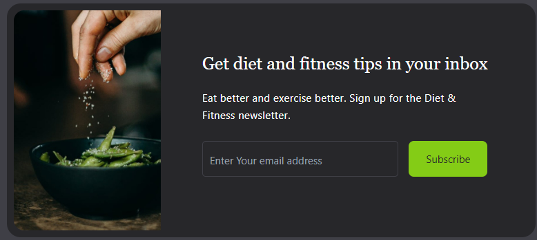
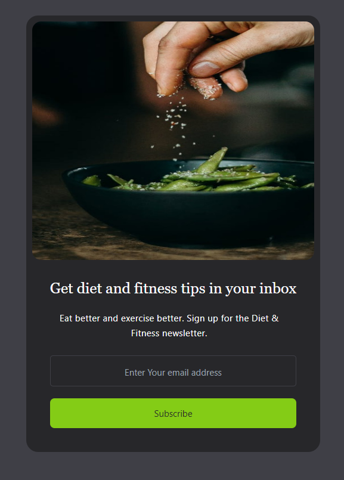

# Email Subscribe Form

This project is a simple email subscription form designed using HTML and Tailwind CSS. The form allows users to subscribe to a diet and fitness newsletter.

## Screenshot
**Desktop:**

**Mobile:**

## Features

- **Responsive Design:** The form is fully responsive and adjusts to various screen sizes.
- **Tailwind CSS:** Utilizes Tailwind CSS for styling and responsive design.
- **Interactive Elements:** Hover effects on the image and subscribe button for an enhanced user experience.

## Design Process

1. **Background Container:** A full-screen flex container centers the card in the viewport.
2. **Card Design:** The card contains an image and content section, styled with padding and rounded corners.
3. **Image Styling:** The image is responsive with hover effects for scaling and rounded corners.
4. **Content Section:** Includes a title, description, and input field for email, all styled for readability and accessibility.
5. **Button Design:** The subscribe button changes color on hover to indicate interactivity.

